# J Read - Corner Pocket App

2023-12-18 \| Taaffeite cohort

# Application Overview

Corner pocket is designed to be a league manager for local leagues. Most
pickup leagues have to rely on paper and word of mouth to coordinate,
score, and declare winners. Corner pocket is designed to take the
guesswork out of the equation. Select your sport, tournament type, and
then invite your friends to join the league. For proof of concept, I'm
designing it for use in 8-ball billiards 5-man teams to apply it to an
existing league. However the database structure should allow it to apply
to almost any sport/activity with a few tweaks. The centerpiece is a
scoring app to keep track of the games themselves.

#  

# Functional Requirements

## 1.1 Log-in (Desktop)

> 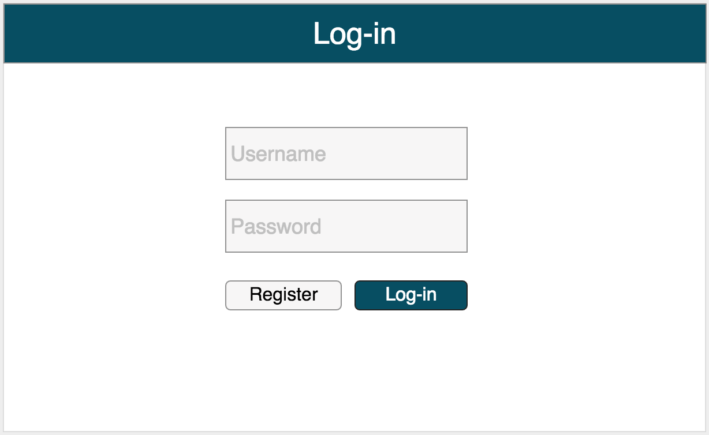{width="5.880208880139983in"
> height="3.604371172353456in"}
>
> Registered users will be able to log in to the application. The
> **Log-in** page will contain a link to the **Registration** page (no
> wireframe included). **Registration** will contain text inputs for
> username and password. The **Registration** page will also contain a
> button that navigates the user back to the **Log-in** screen and a
> button that will submit the form. After successful form submission,
> the user will automatically be logged in with the new account. While a
> desktop version exists, the application itself is optimized for
> mobile.
>
> Forgot password will not be included in this project.

##  

## 1.1 Log-in (Mobile)

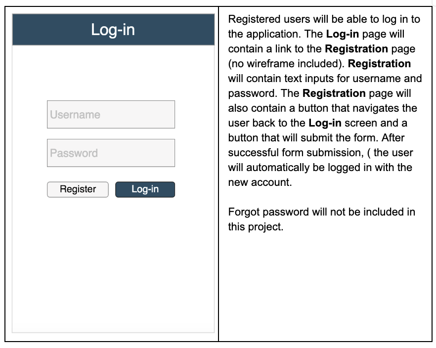

## 1.2 Display List of Widgets

> There are 4 main sections of the app with a few subsections as well
> that can be replicated across the application.
>
> The Home page has three options depending on the current status of the
> user.

1.  Home view - logged in and with an active league

> 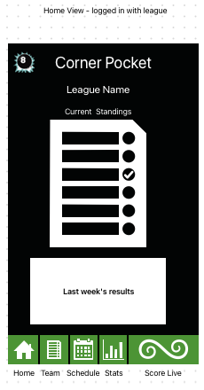

2.  Home view - logged in without an active league.

> 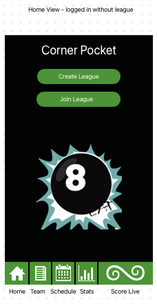

3.  Home view - not logged in

> 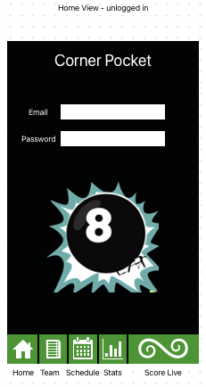

4.  Team roster - Clicking on a name opens a detail view with contact
    info and stats

> 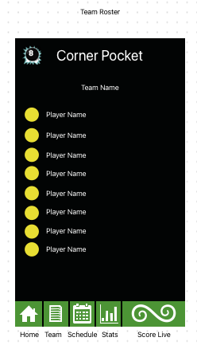

5.  Stats

> 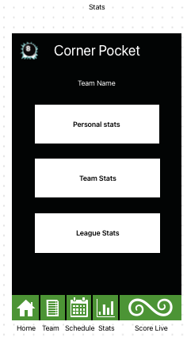

6.  Scoring app - Set lineup view (for team captains). Once the lineup
    is set, for each team, the match can begin.

> 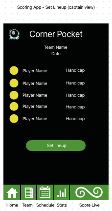

7.  Scoring app - Match View

> 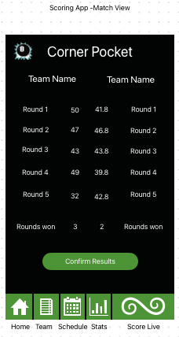

8.  Scoring app - Round view

> 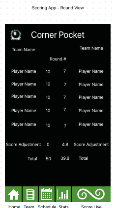

9.  Last will be a schedule view as a stretch goal. Be able to see at a
    glance all the upcoming matchup time/date/locations.

# 3rd Party APIs

Used in stretch goals

-   Google sign-in
    [[https://developers.google.com/identity/sign-in/ios/start]{.underline}](https://developers.google.com/identity/sign-in/ios/start)

-   Google Calendar integration

-   Google Maps embedding

# Project Milestones and Schedule

| **Complete** | **Milestone**                   | **Hours Est** | **Due Date** | **Base or Stretch** |
|--------------|---------------------------------|---------------|--------------|---------------------|
| ☑            | Component scaffolding           | 2             | 12/24        | Base                |
| ☑            | Make the login page.            | 4             | 12/27        | Base                |
| ☐            | Router and query building       | 8             | 1/3          | Base                |
| ☐            | Initial league creation process | 8             | 1/3          | Base                |
| ☐            | Stats and Team views            | 8             | 1/6          | Base                |
| ☐            | Scoring app - Set lineup        | 4             | 1/8          | Base                |
| ☐            | Scoring app - Round view        | 4             | 1/8          | Base                |
| ☐            | Scoring app - Match view        | 4             | 1/10         | Base                |
| ☐            | Conditional styling             | 4             | 1/12         | Base                |
| ☐            | Comments and README             | 4             | 1/16         | Base                |
| ☐            | Calendar view                   | 8             | 1/18         | Stretch             |
| ☐            | Google Account sign-in          | 8             | 1/21         | Stretch             |
| ☐            | Recover password                | 6             | 1/24         | Stretch             |

# Database Documentation

[Database diagram:
[[https://drawsql.app/teams/8bit-heroes/diagrams/corner-pocket]{.underline}](https://drawsql.app/teams/8bit-heroes/diagrams/corner-pocket)]{.mark}

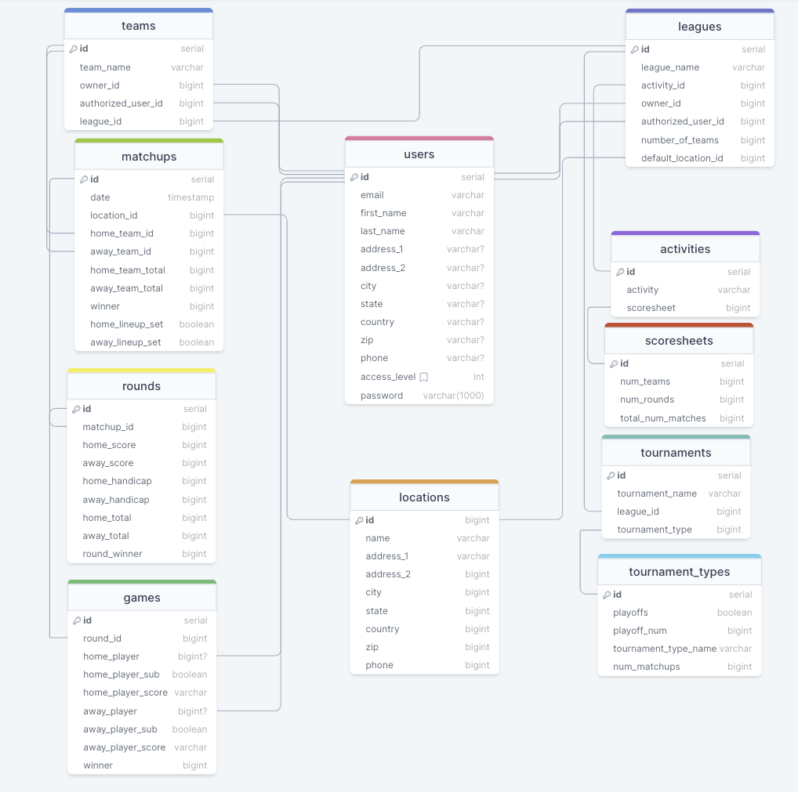

#  

# Browsers

Application will fully support browsers listed below. All browsers or
versions not listed below are considered out of scope.

| **Browser Name** | **Mobile or Desktop?** | **Version**     |
|------------------|------------------------|-----------------|
| Chrome Mobile    | Mobile - iOS           | Version 120.0.6 |

# Technologies

-   Node.js

-   Express.js

-   React.js

-   Postgresql

-   AWS Amplify

-   AWS S3

-   AWS Route 53
